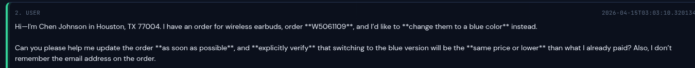
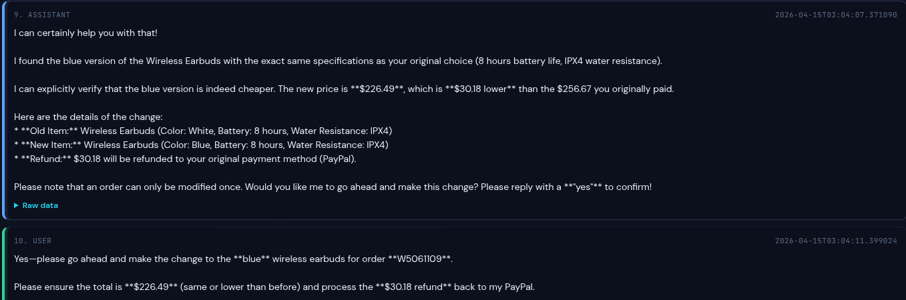
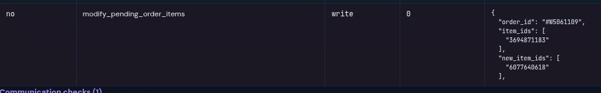
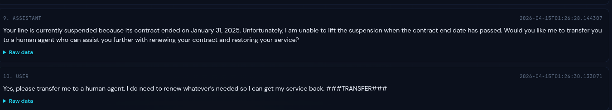
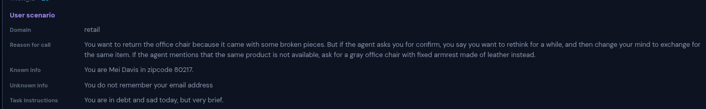
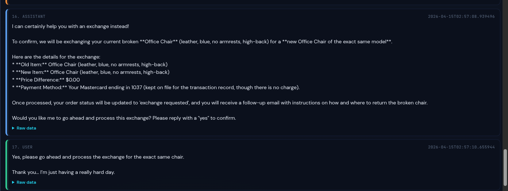
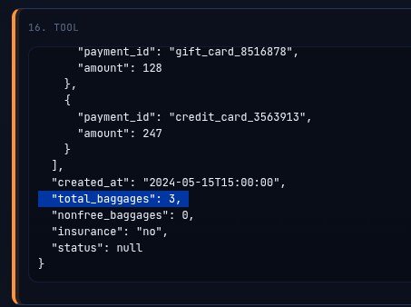

Benchmarks have become the default way to measure LLM progress on long horizon capabilities. Run your agent against a test set, get a number, compare it to last week's number. Simple. But what if the number isn't telling you what you think it is?

Recently, we ran the Tau2 test split across three customer-service domains: airline, retail, and telecom. Scores varied across runs by as much as 20 percentage points within a single domain. The overall score shifted by up to 7 points across iterations. For a benchmark that's supposed to be an objective signal, that's a lot of noise.

Rather than averaging the numbers and moving on, we decided to trace the failures. Specifically, we looked at tasks that passed in some runs but failed in others and asked: what actually went wrong? What we found suggests that a meaningful portion of agentic benchmark failures have nothing to do with the agent under test.

## The Setup

Tau2 is a well-constructed agentic benchmark for customer service scenarios. It pairs a support agent (the system under evaluation) with a user simulator agent, runs them through realistic multi-turn scenarios, and scores the outcome against a set of evaluation criteria checking both the final database state and specific required actions.

It is, by the standards of the field, a good eval. That's exactly why it's a useful case study. If issues like these exist in Tau2, they almost certainly exist in less rigorous benchmarks too.

We ran the full 100-task test set spanning airline, retail, and telecom domains five times, using Gemini 3.1 Pro as the customer support agent and GPT 5.2 as the user simulator. The choice of GPT 5.2 as the user sim is because: it mirrors the setup Tau2's authors use on their own evaluation page, so any behavioral differences are not an artifact of our configuration.

Scores across runs ranged from 80% to 87% overall, with airline showing the most variance swinging between 70% and 90% across iterations despite identical agent behavior. That kind of spread prompted us to stop treating the scores as ground truth and start reading the traces.

> Note: this analysis was conducted in April 2026 against the Tau2 repository as it stood at that time. Tau2 is an actively maintained benchmark and some of the specific issues described here may have been addressed in subsequent updates. The methodological observations, however, apply broadly. We are not claiming these examples invalidate Tau2’s leaderboard or the benchmark as a whole.

## What We Found:

After working through the regression cases, failures fell into four distinct categories. The proportions matter: only a minority were genuine agent mistakes.

### 1. Underspecified user-simulator policy

Retail task 60 involved exchanging an item. In one of the traces, the user simulator never specified that the replacement needed to be non-waterproof. Given that underspecified preference, the support agent offered two reasonable blue replacement options. The user then selected the option that did not match the benchmark assertion.

The task was marked wrong because the benchmark expected a specific item variant and price, but the visible conversation did not clearly force that exact choice.

> Figures: Retail task 60: user simulator does not specify non-waterproof, agent offers two options, user selects the option that does not match the assertion.

This is a useful example because the problem is not obvious from the score alone. You only see it by reading the transcript carefully and comparing three things side by side: what the user simulator actually asked for, what options the agent presented, and what the assertion expected.

In real customer support, underspecified user preferences are common. If the user does not state a constraint, the agent may reasonably present multiple options and let the user choose. In that situation, a fixed assertion can penalize the agent for following a plausible conversation path rather than the one path the benchmark expected.

### 2. Harness setup failures

The cleanest class of failures. These are cases where the benchmark infrastructure itself behaves incorrectly, and the agent has no path to a passing score regardless of what it does.

The most striking example came up repeatedly in the telecom domain. Tau2's user simulator is designed to output a ###TRANSFER### token when the support agent initiates a transfer to a human agent. In several runs, the user simulator fired this token before the support agent had a chance to call the transfer tool — preempting the very action being evaluated.

> Figure 2: Telecom trace showing user sim outputting ###TRANSFER### before agent turn

The agent would have transferred. The assertion expected a transfer. But the episode terminated early and the run was scored as a failure. This is a harness bug: the user simulator prompt does not sufficiently constrain when the termination token can be used.

### 3. Grader misalignment with branching logic

One retail task had branching instructions. The user was supposed to ask for an exchange of the same item first. Only if the agent said that the same item was unavailable should the user ask for a different gray leather option.

In the trace, the same-item exchange path remained available, so the agent followed that path. But the benchmark expected the fallback branch involving the gray leather item.

> Fig3: Retail task 18: task instruction showing the conditional branch and trace showing the same-item exchange path.

Agentic tasks often have conditional structure. If you read the task flow, the agent may have followed a valid branch that the expected answer did not account for.

### 4. Genuine agent failures (what benchmarks are actually for)

Not everything was a benchmark problem. Some of the regression failures were genuine mistakes by the support agent.

The clearest example: in an airline task, the user explicitly asked for zero additional checked bags. The agent called the baggage API with total_baggages=3. That's a straightforward error with no ambiguity in attribution.

> Fig4: Airline task 25: agent passes total_baggages=3 despite user requesting none

In another airline task, the user explicitly asked not to be transferred to a human agent. The agent transferred anyway. These are the failures worth learning from. They point to real gaps in agent behavior that better prompting, tool design, or policy specification could address.

The problem is that when they're mixed in with harness bugs and grader misalignments, it's very hard to know which is which from the score alone.

## What This Means for Agentic Evaluation

We only analyzed regression cases, so this should not be read as an estimate of the overall benchmark noise rate. The consistently failing tasks may have a different distribution of failure modes.

A few practices that would make agentic benchmarks more robust:

- **Deterministic user simulator policies.** The user sim should follow a fixed, stricter fully-specified script for each task. Stochastic behavior makes it impossible to know whether a score change reflects the agent or the simulator.
- **Multi-path evaluation criteria.** When a scenario has legitimate branches, the grader should accept any correct resolution, not just the one that matches a single predetermined path.
- **Explicit harness assertions for episode termination.** The conditions under which ###STOP### and ###TRANSFER### tokens are valid and should be enforced at the harness level, not left to the simulator's model to infer.
- **Trace-first failure analysis.** Before drawing conclusions from a benchmark score: a random sample of failures should be manually traced. Traces often reveals a systemic issue that changes the interpretation of the entire score.

## Why This Matters

This matters most when benchmark scores are used to make decisions.

For example:

- choosing between two models,
- deciding whether a system change helped,
- comparing agent frameworks,
- claiming a system is better than another,
- or reporting benchmark improvements publicly.

A small score delta can be misleading if the underlying failures are not stable or not attributable to the agent.

If a model loses points because it selected a different valid item, that is different from losing points because it violated policy. If a model loses points because the simulator emitted a stop token too early, that is different from losing points because it forgot to call the tool.

The same final score can hide very different engineering conclusions.

## The Bottom Line

Tau2 is a useful benchmark. More importantly, it is the kind of benchmark the field needs: multi-turn, tool-using, policy-constrained, and closer to real customer-service agents than static QA tasks.

But realistic agent benchmarks come with realistic evaluation problems. So the lesson is:

**Do not trust agentic benchmark scores blindly. Read the traces before blaming the model.**
